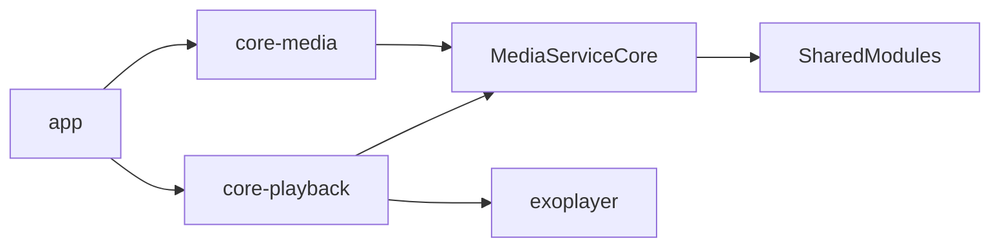

# PhoneTube

**Versión 1.0.1**

Cliente Android de YouTube orientado a móvil, escrito en **Kotlin** y **Jetpack Compose**. Reproduce contenido con **ExoPlayer**, consume la API vía **MediaServiceCore** (ecosistema SmartTube) e incluye **SponsorBlock** configurable.

> Proyecto en desarrollo activo. Algunas pestañas (Shorts, biblioteca completa, subir video) son placeholders.

---

## Características

| Área | Detalle |
|------|---------|
| **Inicio** | Feed con filtros: Todo, Música, Gaming, En directo |
| **Reproductor** | Calidad, velocidad, subtítulos, mini player, videos relacionados |
| **SponsorBlock** | Salto automático de segmentos; categorías configurables en ajustes |
| **Cuenta** | Inicio de sesión Google / cuentas YouTube (SmartTube auth) |
| **Búsqueda** | Resultados con la misma UI de feed |
| **Canal** | Página de canal y suscripción |
| **UI** | Tema oscuro tipo YouTube, strings **EN / ES** |
| **Navegación** | Bottom bar: Inicio, Shorts*, Suscripciones*, Crear*, Tú* |

\*Pestaña visible; funcionalidad limitada o pendiente.

---

## Stack

- Android SDK **34**, `minSdk` **21**
- Jetpack Compose + Material 3
- Navigation Compose, ViewModel, Coroutines
- ExoPlayer (fork `exoplayer-amzn-2.10.6`)
- Coil, OkHttp
- Submódulos: [MediaServiceCore](https://github.com/yuliskov/MediaServiceCore), [SharedModules](https://github.com/yuliskov/SharedModules)

---

## Estructura del repositorio

```
phone-tube/
├── app/                    # UI Compose, navegación, pantallas
├── core-media/             # YouTubeRepository, auth, feeds
├── core-playback/          # ExoPlayer, SponsorBlockEngine
├── MediaServiceCore/       # submódulo — API YouTube
├── SharedModules/          # submódulo — utilidades SmartTube
├── exoplayer-amzn-2.10.6/  # ExoPlayer empaquetado en el repo
├── gradle/                 # Wrapper
├── keystore.properties.example
└── local.properties.example
```



---

## Requisitos

- **JDK 11+**
- **Android SDK 34** (Android Studio o CLI)
- Git con soporte de submódulos

---

## Clonar e inicializar

```bash
git clone --recurse-submodules https://github.com/TU_USUARIO/phone-tube.git
cd phone-tube
```

Si ya clonaste sin submódulos:

```bash
git submodule update --init --recursive
```

### Configuración local

1. Copia la plantilla del SDK:

   ```bash
   cp local.properties.example local.properties
   ```

   Edita `sdk.dir` con la ruta de tu Android SDK.

2. *(Opcional, solo release firmado)* Copia y rellena el keystore:

   ```bash
   cp keystore.properties.example keystore.properties
   ```

   Coloca tu `.jks` en la raíz y completa contraseñas y alias. **No subas** `keystore.properties` ni `*.jks` a GitHub.

### Antes de subir a GitHub

El `.gitignore` ya excluye SDK local, keystores, builds, `.idea/`, `.cursor/`, `.codegraph/` y APK/AAB. Antes de cada commit o push:

```powershell
git status
git diff --stat
git check-ignore -v local.properties
```

**No hagas** `git add -f` sobre `local.properties`, `keystore.properties`, `*.jks`, `.env`, carpetas `build/` o `.gradle/`.

Si algo sensible se coló al índice por error (sin haber hecho push aún):

```powershell
git rm --cached local.properties
```

Si ya llegó a GitHub, hay que rotar contraseñas del keystore y limpiar el historial (`git filter-repo` o soporte de GitHub); no basta con borrarlo en un commit nuevo.

---

## Compilar

Desde la raíz del proyecto.

### Debug (instalar en el teléfono)

**Windows (PowerShell):**

```powershell
.\gradlew.bat :app:assembleStphonetubeDebug
```

**Linux / macOS:**

```bash
./gradlew :app:assembleStphonetubeDebug
```

APK:

`app/build/outputs/apk/stphonetube/debug/app-stphonetube-debug.apk`

Instalar con USB:

```bash
adb install -r app/build/outputs/apk/stphonetube/debug/app-stphonetube-debug.apk
```

### Release

Con `keystore.properties` configurado:

```powershell
.\gradlew.bat clean :app:assembleStphonetubeRelease
```

APK:

`app/build/outputs/apk/stphonetube/release/app-stphonetube-release.apk`

> Si cambias de firma (debug → release propio), **desinstala** la app anterior antes de instalar.

### Bundle (Google Play)

```powershell
.\gradlew.bat :app:bundleStphonetubeRelease
```

AAB:

`app/build/outputs/bundle/stphonetubeRelease/app-stphonetube-release.aab`

---

## Módulos principales

| Módulo | Responsabilidad |
|--------|-----------------|
| `app` | Compose UI, `PhoneTubeNavHost`, pantallas Home / Player / Search / Settings |
| `core-media` | `YouTubeRepository`, feeds, búsqueda, metadatos, auth |
| `core-playback` | `PhonePlayerController`, ExoPlayer, `SponsorBlockEngine` |
| `MediaServiceCore` | Cliente HTTP YouTube (fork SmartTube) |
| `SharedModules` | Preferencias, J2V8, utilidades compartidas |


---

## Créditos

- Motor YouTube y capa de servicio basados en **[SmartTube](https://github.com/yuliskov/SmartTubeNext)** / **[MediaServiceCore](https://github.com/yuliskov/MediaServiceCore)** por [yuliskov](https://github.com/yuliskov).
- **[SponsorBlock](https://sponsor.ajay.app/)** para segmentos de patrocinadores.
- **ExoPlayer** (Google) — fork Amazon incluido en este repo.

---

## Aviso legal

PhoneTube es un proyecto independiente y **no está afiliado a Google ni a YouTube**. El uso de clientes alternativos puede infringir los términos de servicio de YouTube. Úsalo bajo tu propia responsabilidad.

---

Hecho con ❤️ por **John Stukov**
